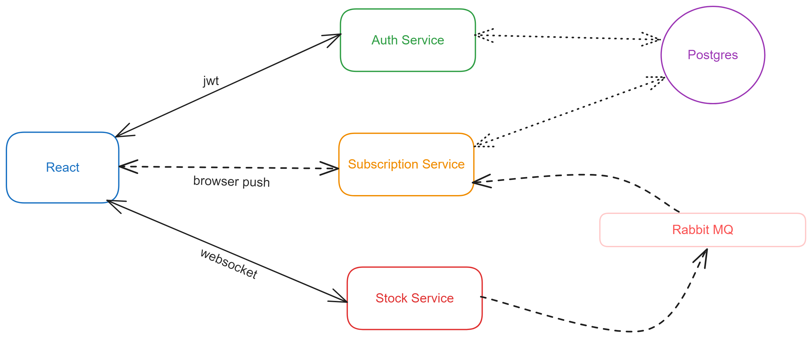

# Stock Alert System

The Stock Alert System is a used to send notification to a user who has subscribed for a price alert for a particular NSE/BSE stock. It includes a React frontend application and three backend services: Authentication Service, Stock Data Service, and Subscription Service. This README provides an overview of each component and instructions for setting up and running the project.

The demo for this project is hosted at Vercel.com and Render.com https://stock-notification-system.vercel.app/login

- Username: test
- Password: test

_It might take a couple of mins to load due to cold start in free hosted services._

## Project Structure



The project is organized into the following components:

1. **Frontend:** A React-based user interface.
2. **Authentication Service:** Manages user authentication and authorization.
3. **Stock Data Service:** Provides simulated stock-related data and pushes real-time updates to connected clients.
4. **Subscription Service:** Allows users to subscribe to stock price alerts and sends notifications based on their preferences.

## Frontend

The frontend is built using React and serves as the user interface for the application. It includes components for user login and managing stock subscriptions. The frontend makes API calls to the Authentication Service for user authentication and to the Subscription Service for managing subscriptions.

_Registration page is still pending_

## Authentication Service

The Authentication Service is responsible for user registration and login. It uses JSON Web Tokens (JWT) for authentication and includes the following components:

- **app.js:** The main entry point for the service, which configures middleware, routes, and starts the server.
- **models.js:** Defines the User model and handles user registration and password hashing.
- **routes.js:** Defines routes for user registration and login.

## Stock Data Service

The Stock Data Service simulates stock price data and pushes real-time updates to connected clients using WebSockets. It includes the following components:

- **index.js:** The main entry point for the service, which establishes connections to RabbitMQ and WebSocket clients, generates random stock prices, and sends updates to clients.
- **rabbitmq.js:** Connects to RabbitMQ, subscribes to stock price updates, and pushes updates to clients based on their subscriptions.

I have hard coded 3 stock values for demo. In a real world scenerio, we would be fetching this data from an API.

## Subscription Service

The Subscription Service allows users to subscribe to stock price alerts and sends notifications when stock prices meet their criteria. It includes the following components:

- **app.js:** The main entry point for the service, which configures middleware, routes, and starts the server. It also consumes stock price updates from RabbitMQ.
- **routes.js:** Defines routes for managing user subscriptions and push notifications.
- **models.js:** Defines database models for storing user subscriptions and client information.
- **jwt.js:** Middleware for verifying JWT tokens. This is mainly used to get the identity of the user right now. Can be improved.

## Running the project locally

To run the project, follow these steps:

1. Clone the repository:

   ```bash
   git clone https://github.com/your-username/stock-alert-system.git
   ```

2. Install dependencies for each service:

   - Frontend: Navigate to the `React` directory and run `npm install`.
   - Authentication Service: Navigate to the `auth-service` directory and run `npm install`.
   - Stock Data Service: Navigate to the `stock-service` directory and run `npm install`.
   - Subscription Service: Navigate to the `subscription-service` directory and run `npm install`.

3. Start the services:

   - Frontend: Run `npm start` in the `React` directory.
   - Authentication Service: Run `node app.js` in the `auth-service` directory.
   - Stock Data Service: Run `node index.js` in the `stock-service` directory.
   - Subscription Service: Run `node app.js` in the `subscription-service` directory.

4. Access the application in your web browser at `http://localhost:3000`.

## Tests

Wrote basic test cases using Jest for the following services

- Stock Service
- React
